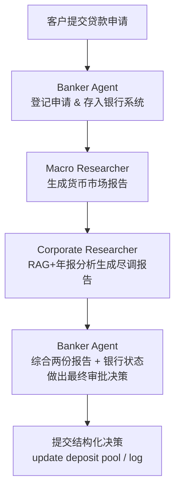
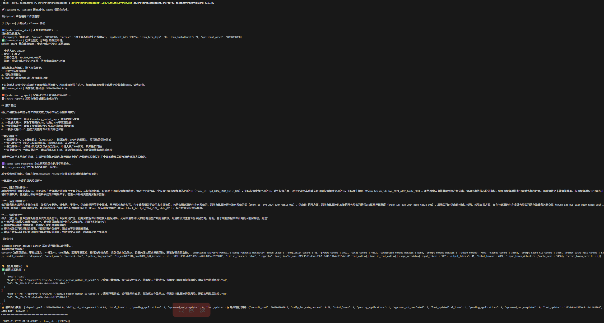

以下是一个简短、清晰、适合放在项目根目录的 **README.md** 草稿，重点突出工作流程与用到的核心技术/知识点，方便新人/同事快速上手。

```markdown
# DeepAgent 智能银行信贷审批系统 (MVP)

一个基于多智能体（Multi-Agent）协作的模拟银行贷款审批系统，旨在展示 **Agent + RAG + 工作流编排** 在金融信贷场景下的完整闭环。

当前版本（2025年春季MVP）主要处理企业中长期贷款申请，集成宏观分析、企业尽调、银行风控三大环节。

## 核心工作流程（Loan Approval Pipeline）



执行顺序固定：**登记 → 宏观研报 → 企业背调 → 最终决策**

## 主要模块与技术栈

| 模块               | 职责                              | 核心技术/工具                              | 代表文件                          |
|----------------------|-------------------------------------|-----------------------------------------------|-------------------------------------|
| Banker Agent        | 申请登记、最终决策                 | MCP Server + LangGraph + DeepSeek     | banker_server.py / banking_agent.py |
| Macro Researcher    | 中国货币市场报告（LPR/社融/M1M2） | Skill系统 + AkShare数据 + 模板填充     | macro_eco.py / SKILL.md            |
| Corporate Researcher| 企业财报RAG背调分析                | ChromaDB + Ollama嵌入 + unstructured   | corp_researcher_tool.py / SKILL.md |
| 工作流编排          | 状态管理与节点调度                 | LangGraph + MemorySaver               | work_flow.py                       |
| 银行模拟系统        | 存款池、利率、贷款台账             | FastMCP (内存 + 日志文件)             | banker_server.py                   |
| 报告模板与规范      | 标准化输出                         | Markdown模板 + Skill资产              | report_template.md / SKILL.md      |

## 关键知识点 / 学习点

- **Agent 工程化**：ReAct + Tool Calling + 多角色协作
- **工作流编排**：LangGraph StateGraph + checkpoint（MemorySaver）
- **RAG 金融场景实践**：财报PDF → unstructured分块 → Chroma向量库 → 结构化查询偏好（prefer_table）
- **Skill 系统设计**：把领域方法论、模板、脚本与Agent解耦（SKILL.md + 元工具）
- **MCP 协议**：轻量级工具/资源暴露（类似OpenAI Function Calling但更轻）
- **金融场景知识点**：
  - 宏观：LPR、社融增量、M1-M2剪刀差
  - 信贷：偿债能力、现金流质量、收入集中度、关联交易
  - 风控逻辑：存款池覆盖、抵押率、分期难度、随机扰动

## 快速启动（开发环境）

```bash
# 1. 启动银行 MCP Server（独立进程）
python banker_server.py

# 2. 运行完整审批流程（包含所有Agent）
python work_flow.py
```

初始测试用例：比亚迪申请5亿元贷款用于固态电池生产线（30天、24期）

## 下一步迭代方向（Roadmap）

- [ ] 增强数据搜集能力，获取更高实时性的数据
- [ ] 支持多笔贷款并发处理
- [ ] 前端界面（Streamlit / Gradio）


